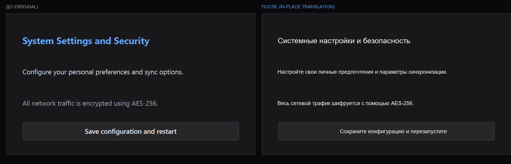

# Screen Translator

**English** • [Русский](README_RU.md)

A minimalist Windows screen translator inspired by **Win + Shift + S** (Snipping Tool) and **Google Lens / Circle to Search**.

Select any screen region and see instant in-place translated text rendered seamlessly over the original without bulky popups, buttons, or visual clutter.



---

## Features

* **Win + Shift + S Inspired UX:**
  * Clean background operation from the Windows system tray with zero desktop widgets.
  * Screen dimming with a thin, minimalist white selection border (1.5px).
  * Dynamic crosshair cursor that only appears while dragging a selection.
* **In-Place Seamless Translation (Circle to Search Style):**
  * Native offline **Windows OCR** (`winocr` via WinRT API) with sub-pixel screen coordinate preservation (DPI-aware).
  * Smart line clustering: words on the same horizontal plane are grouped into continuous sentences.
  * Automatic background color sampling and high-contrast text rendering.
  * Borderless in-place text replacement.
* **Interactive Text & Mouse Selection:**
  * Click and drag across **multiple lines** to highlight text and copy with **`Ctrl + C`** (or `Ctrl + A` for all text).
  * Double-click on any word to accurately select and copy only that word.
* **Instant Keyboard Shortcuts:**
  * **`Alt + Q`**, **`Ctrl + Shift + S`**, or **`Alt + T`** — trigger the screen translator from anywhere.
  * **`Tab`** — toggle between translation and original text in-place.
  * **`F4`** — open a dark-gray minimalist language palette with instant `1`–`9` hotkeys and live re-translation.
  * **`Esc`** or click outside selection — instantly exit.
* **Reliability:**
  * Atomic Windows Mutex (`CreateMutexW`): ensures a strict single-instance process and prevents duplicate tray icons.
  * Native Win32 `RegisterHotKey`: will never hook low-level keys or interfere with `Alt + Shift` language switching.

---

## Installation

Requires **Python 3.10+** and Windows 10/11.

```bash
git clone https://github.com/arturg-sudo/screen-translator.git
cd screen-translator
pip install -r requirements.txt
```

---

## Usage

### Run in background:
Double-click `run.bat` or execute:
```bash
pythonw main.py
```

### Instant single-capture trigger:
```bash
python main.py --now
```

---

## Hotkeys

| Shortcut | Description |
| --- | --- |
| **`Alt + Q`** / **`Ctrl + Shift + S`** / **`Alt + T`** | Activate screen translator |
| **`Tab`** | Toggle original / translated text in-place |
| **`F4`** | Open language selection palette (`1`–`9`) |
| **`Ctrl + C`** | Copy selected text (or double-click word) |
| **`Ctrl + A`** | Select all translated text |
| **`Esc`** | Exit overlay |

---

## License

MIT License. See [LICENSE](LICENSE) for details.
